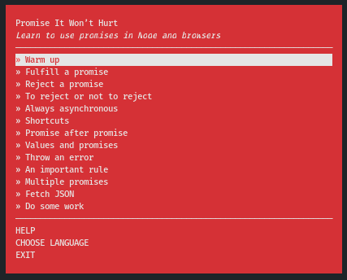

# "Promise It Won’t Hurt" within Docker

This is a [Nodeschool's](https://nodeschool.io/) workshop dockerized with Node 12.

**Warning:** the package does not work with Node 14 or newer.

## Usage
### First run
* `docker-compose up --build`
* `./run npm i`

### Interacting commands
* `./run npm run start`
* `./run npm run print`
* `./run npm run verify src/filename.js`
* `./run npm run help`

Basically, instead of `promise-it-wont-hurt ...` you should type `./run.sh npm run ...`.

## Links

- [Source](https://github.com/stevekane/promise-it-wont-hurt)
- [More interactive tutorials like this](https://nodeschool.io/)
